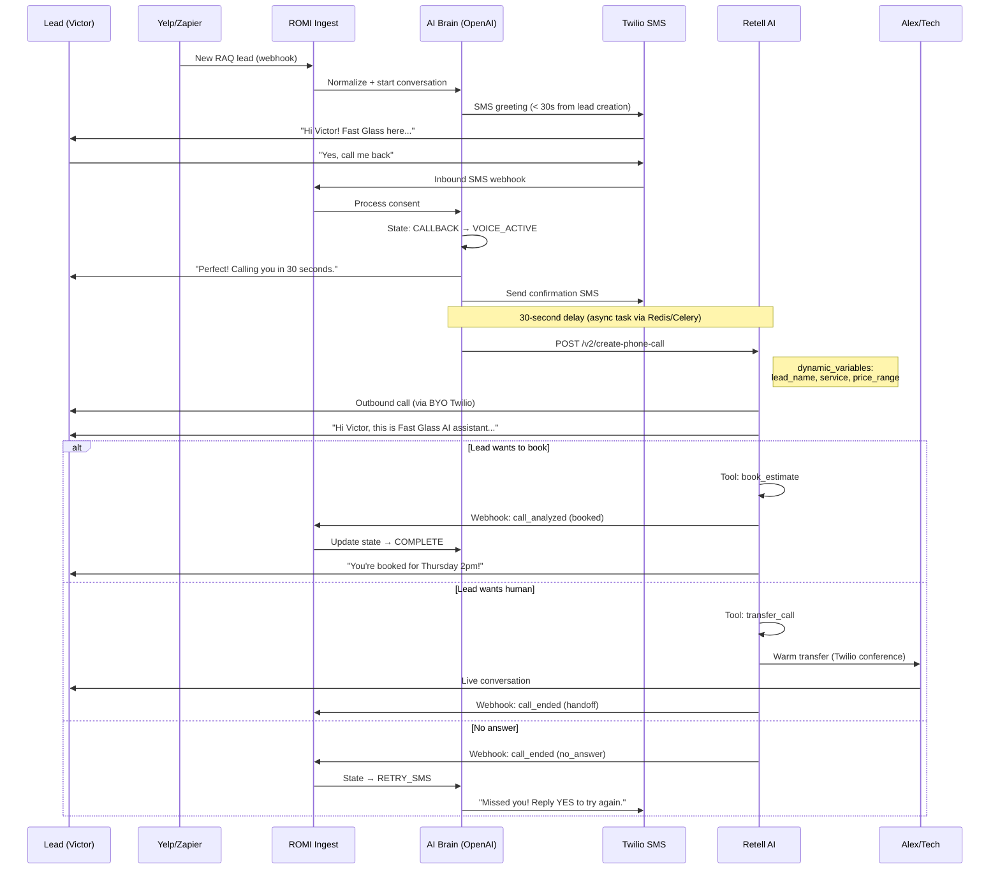
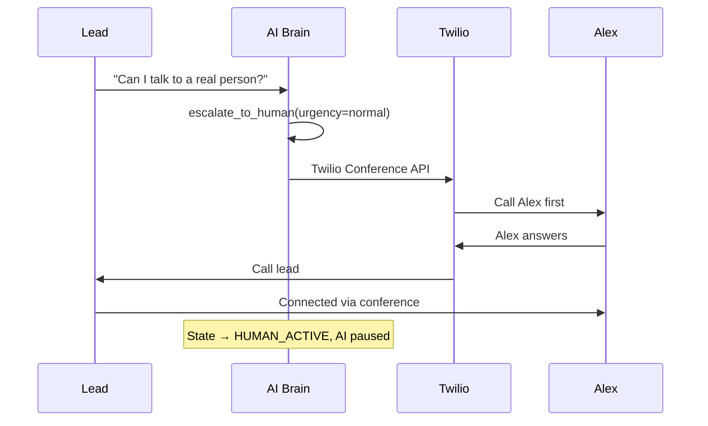

# AI Lead Responder — System Design (Phase 2)

> **Module:** ROMI CRM Module 10  
> **Date:** 2026-06-14  
> **Stack:** FastAPI + PostgreSQL + Next.js + Twilio + OpenAI (+ Retell for Phase 1 voice)

---

## 1. System Architecture — 3 Layers

```
┌─────────────────────────────────────────────────────────────────────────────┐
│                           CHANNEL SOURCES                                    │
│  Yelp (Zapier) │ Website Widget │ SMS (Twilio) │ Thumbtack* │ Google LSA*  │
└───────┬──────────────┬─────────────────┬────────────────────────────────────┘
        │              │                 │
        ▼              ▼                 ▼
┌─────────────────────────────────────────────────────────────────────────────┐
│  LAYER 1: INGEST                                                             │
│  ┌──────────────┐  ┌──────────────┐  ┌──────────────┐  ┌──────────────┐    │
│  │ Zapier       │  │ Webhook      │  │ Twilio SMS   │  │ Future       │    │
│  │ Webhook      │  │ /widget      │  │ Webhook      │  │ Adapters     │    │
│  │ Receiver     │  │ Receiver     │  │ Receiver     │  │              │    │
│  └──────┬───────┘  └──────┬───────┘  └──────┬───────┘  └──────────────┘    │
│         │                  │                 │                               │
│         └──────────────────┼─────────────────┘                               │
│                            ▼                                                 │
│              ┌─────────────────────────┐                                   │
│              │  Normalizer + Router    │                                   │
│              │  (channel → lead_id)    │                                   │
│              └────────────┬────────────┘                                   │
└───────────────────────────┼─────────────────────────────────────────────────┘
                            │
                            ▼
┌─────────────────────────────────────────────────────────────────────────────┐
│  LAYER 2: AI BRAIN                                                           │
│  ┌─────────────────────────────────────────────────────────────────────┐    │
│  │  Conversation Orchestrator (FastAPI service)                         │    │
│  │  • State machine engine                                               │    │
│  │  • OpenAI GPT-4.1 (chat) / tool routing                              │    │
│  │  • RAG retriever (pgvector on kb_documents)                          │    │
│  │  • Persona + guardrails config                                       │    │
│  └──────────────────────────┬──────────────────────────────────────────┘    │
│                             │                                                │
│  ┌──────────────────────────▼──────────────────────────────────────────┐    │
│  │  Tool Executor                                                        │    │
│  │  get_price │ check_availability │ book_estimate │ trigger_callback   │    │
│  │  escalate_to_human │ get_service_info │ check_service_zone           │    │
│  └─────────────────────────────────────────────────────────────────────┘    │
└───────────────────────────┬─────────────────────────────────────────────────┘
                            │
                            ▼
┌─────────────────────────────────────────────────────────────────────────────┐
│  LAYER 3: ACTION                                                             │
│  ┌────────────┐  ┌────────────┐  ┌────────────┐  ┌────────────────────┐    │
│  │ Twilio SMS │  │ Retell     │  │ ROMI CRM   │  │ Notifications      │    │
│  │ Send API   │  │ Outbound   │  │ Leads/Jobs │  │ (Slack/email/push) │    │
│  │            │  │ Voice Call │  │ Pipeline   │  │                    │    │
│  └────────────┘  └────────────┘  └────────────┘  └────────────────────┘    │
└─────────────────────────────────────────────────────────────────────────────┘
```

### Fit into ROMI CRM Architecture

Extends existing `docs/ARCHITECTURE.md` stack:

| Existing | Module 10 Addition |
|----------|-------------------|
| `POST /api/v1/leads/` | Auto-create lead from ingest with `source=ai_responder` |
| `POST /api/v1/calls/webhook/twilio` | Extend for SMS + voice callback status |
| `POST /api/v1/pricing/calculate` | Wrapped as `get_price` tool |
| PostgreSQL `leads`, `contacts`, `calls` | New tables: `ai_conversations`, `ai_messages`, etc. |
| Next.js Dashboard | New section: `/dashboard/ai-responder/*` |

### New FastAPI Router

```
/api/v1/ai-responder/
  POST   /webhooks/zapier/yelp          # Ingest Yelp leads
  POST   /webhooks/twilio/sms           # Inbound SMS
  POST   /webhooks/twilio/voice-status  # Call status callbacks
  POST   /webhooks/retell               # Retell call events
  POST   /widget/message                 # Website widget messages

  GET    /conversations                  # Admin: list conversations
  GET    /conversations/:id              # Admin: thread detail
  POST   /conversations/:id/takeover     # Human assumes control
  POST   /conversations/:id/send         # Human sends message

  GET    /config/persona                 # Bot persona settings
  PUT    /config/persona
  GET    /config/kb                      # Knowledge base docs
  POST   /config/kb                      # Upload KB document
  DELETE /config/kb/:id

  GET    /analytics/speed-to-lead        # Response time KPIs
  GET    /analytics/conversion           # Funnel metrics

  POST   /callbacks/trigger              # Manual callback trigger
  GET    /callbacks/:id                  # Callback status
```

---

## 2. Conversation Flow — State Machine

### States

```
                    ┌─────────┐
                    │  IDLE   │ (no active conversation)
                    └────┬────┘
                         │ lead ingested / inbound message
                         ▼
                    ┌─────────┐
              ┌────│  GREET  │──── timeout 5min ────► FOLLOW_UP_QUEUED
              │    └────┬────┘
              │         │ lead responds
              │         ▼
              │    ┌──────────┐
              │    │ QUALIFY  │◄──────┐
              │    └────┬─────┘       │ need more info
              │         │            │
              │    service identified │
              │         ▼            │
              │    ┌─────────┐       │
              │    │  OFFER  │───────┘
              │    └────┬────┘
              │         │
              │    ┌────┴────────────────┐
              │    ▼                     ▼
              │ ┌──────────┐      ┌──────────────┐
              │ │  CLOSE   │      │   CALLBACK   │
              │ │ (booked) │      │  (consent)   │
              │ └────┬─────┘      └──────┬───────┘
              │      │                   │
              │      ▼                   ▼
              │ ┌──────────┐      ┌──────────────┐
              │ │ COMPLETE │      │ VOICE_ACTIVE │
              │ └──────────┘      └──────┬───────┘
              │                          │
              │              ┌───────────┼───────────┐
              │              ▼           ▼           ▼
              │         ┌────────┐ ┌─────────┐ ┌──────────┐
              │         │BOOKED  │ │HANDOFF  │ │ NO_ANSWER│
              │         └────────┘ └────┬────┘ └────┬─────┘
              │                         │           │
              └──── escalate ──────────►│           │
                                        ▼           ▼
                                   ┌─────────┐  ┌──────────┐
                                   │ HUMAN   │  │ RETRY_SMS│
                                   │ ACTIVE  │  └──────────┘
                                   └─────────┘
```

### State Transition Table

| From | Event | To | Action |
|------|-------|-----|--------|
| IDLE | `lead.created` | GREET | Send personalized greeting via channel |
| GREET | `message.received` | QUALIFY | Ask service type, location, urgency |
| GREET | `timeout.5min` | FOLLOW_UP_QUEUED | Schedule follow-up message |
| QUALIFY | `service.identified` | OFFER | Call `get_price`, present estimate range |
| QUALIFY | `info.missing` | QUALIFY | Ask clarifying question |
| OFFER | `intent.book` | CLOSE | Call `book_estimate` |
| OFFER | `intent.callback` | CALLBACK | Ask consent for phone callback |
| OFFER | `intent.escalate` | HUMAN_ACTIVE | Notify Alex, pause AI |
| CALLBACK | `consent.yes` | VOICE_ACTIVE | Schedule `trigger_callback` in 30s |
| CALLBACK | `consent.no` | OFFER | Continue text conversation |
| VOICE_ACTIVE | `call.completed.booked` | COMPLETE | Update lead stage |
| VOICE_ACTIVE | `call.completed.handoff` | HUMAN_ACTIVE | Warm transfer to tech |
| VOICE_ACTIVE | `call.no_answer` | RETRY_SMS | "Missed you — reply YES to reschedule call" |
| * | `human.takeover` | HUMAN_ACTIVE | AI pauses, human sends messages |
| HUMAN_ACTIVE | `human.release` | previous | AI resumes |

### Greeting Templates (AI-generated, not static)

The AI brain uses persona config + lead context to generate — not mail-merge templates:

```
# System prompt excerpt (persona)
You are Alex's AI assistant at Fast Glass & Windows, LA's trusted glass repair company.
Be warm, professional, concise. Never quote exact prices without calling get_price.
Always ask if they want a callback within 30 seconds for complex jobs.

# Dynamic context injected per conversation
Lead: Victor M.
Channel: yelp_raq
Project: "Sliding patio door glass replacement, 6ft x 8ft"
ZIP: 90034
Phone: +13105551234 (available)
```

**Example generated greeting (Yelp RAQ):**
> Hi Victor! Thanks for reaching out through Yelp about your patio door glass — we specialize in exactly this. I'm Alex's assistant at Fast Glass & Windows. I can get you a ballpark price right now, or we can call you back in about 30 seconds to discuss details. What works better for you?

---

## 3. Knowledge Base (RAG) Structure

### Document Categories

| Category | Source | Chunks | Priority |
|----------|--------|--------|----------|
| `services` | 51-service pricing CSV/JSON | ~51 docs | High — always retrieved for pricing questions |
| `zones` | Service area ZIP codes (LA metro) | ~15 docs | High — filter leads outside zone |
| `faq` | Common questions (insurance, timeline, warranty) | ~30 docs | Medium |
| `hours` | Business hours, emergency availability | 1 doc | High — injected in every prompt |
| `policies` | Deposit, cancellation, measurement process | ~5 docs | Low |

### Storage & Retrieval

```sql
-- pgvector extension
CREATE EXTENSION IF NOT EXISTS vector;

-- Embedding model: text-embedding-3-small (1536 dims)
-- Index: HNSW for <50ms retrieval at 100+ docs
```

**Retrieval pipeline:**
1. User message arrives → embed query via OpenAI `text-embedding-3-small`
2. Search `kb_chunks` with `category` filter based on state (QUALIFY → services+zones; OFFER → services+pricing)
3. Top 5 chunks (score > 0.75) injected into system prompt
4. For exact pricing: always call `get_price` tool (RAG provides context, tool provides numbers)

### Service Catalog Schema (51 services)

```json
{
  "service_id": "sliding_door_glass",
  "name": "Sliding Door Glass Replacement",
  "category": "doors",
  "base_price_min": 350,
  "base_price_max": 1200,
  "price_factors": ["size", "glass_type", "frame_condition"],
  "typical_duration": "1-2 hours",
  "requires_measure": true,
  "service_zones": ["90001-90899", "90210-90299"],
  "keywords": ["sliding door", "patio door", "door glass", "sliding glass"]
}
```

---

## 4. Tool-Calling Design

OpenAI function calling (GPT-4.1) with strict schemas:

### `get_price`

```json
{
  "name": "get_price",
  "description": "Calculate price estimate for a glass service. Requires service type and dimensions.",
  "parameters": {
    "type": "object",
    "properties": {
      "service_id": { "type": "string", "description": "Service identifier from catalog" },
      "width_inches": { "type": "number" },
      "height_inches": { "type": "number" },
      "glass_type": { "enum": ["annealed", "tempered", "laminated", "low_e", "unknown"] },
      "zip_code": { "type": "string" }
    },
    "required": ["service_id", "zip_code"]
  }
}
```

**Implementation:** Calls existing `POST /api/v1/pricing/calculate` internally.

### `check_availability`

```json
{
  "name": "check_availability",
  "description": "Check next available appointment slots for estimate visit.",
  "parameters": {
    "type": "object",
    "properties": {
      "zip_code": { "type": "string" },
      "preferred_date": { "type": "string", "format": "date" },
      "urgency": { "enum": ["emergency", "this_week", "flexible"] }
    },
    "required": ["zip_code"]
  }
}
```

**Phase 1:** Returns static slots (Mon-Sat 8am-6pm). **Phase 2:** Integrates with HCP/scheduler.

### `book_estimate`

```json
{
  "name": "book_estimate",
  "description": "Book an in-home estimate appointment.",
  "parameters": {
    "type": "object",
    "properties": {
      "contact_name": { "type": "string" },
      "phone": { "type": "string" },
      "address": { "type": "string" },
      "zip_code": { "type": "string" },
      "service_id": { "type": "string" },
      "preferred_datetime": { "type": "string", "format": "date-time" },
      "notes": { "type": "string" }
    },
    "required": ["contact_name", "phone", "zip_code", "service_id"]
  }
}
```

**Implementation:** Creates `lead` + `job` in ROMI CRM, sets stage → `Measure Scheduled`.

### `trigger_callback`

```json
{
  "name": "trigger_callback",
  "description": "Initiate AI voice callback to lead's phone in ~30 seconds.",
  "parameters": {
    "type": "object",
    "properties": {
      "phone": { "type": "string" },
      "lead_name": { "type": "string" },
      "context_summary": { "type": "string" },
      "delay_seconds": { "type": "integer", "default": 30 }
    },
    "required": ["phone", "lead_name", "context_summary"]
  }
}
```

**Implementation:** See §5 Voice Callback Flow.

### `escalate_to_human`

```json
{
  "name": "escalate_to_human",
  "description": "Transfer conversation to human agent (Alex or on-call tech).",
  "parameters": {
    "type": "object",
    "properties": {
      "reason": { "type": "string" },
      "urgency": { "enum": ["normal", "urgent", "emergency"] },
      "notify_via": { "enum": ["sms", "call", "both"], "default": "sms" }
    },
    "required": ["reason"]
  }
}
```

**Implementation:** Sets conversation state → `HUMAN_ACTIVE`, sends SMS to Alex (+1310...), logs in dashboard.

---

## 5. Voice Callback Flow

### Recommendation: Retell AI over Vapi

| Criterion | Retell AI | Vapi | Winner |
|-----------|-----------|------|--------|
| Setup time for 1 dev | 2–4 hours | 1–2 days | **Retell** |
| All-in cost (BYO Twilio) | ~$0.09–0.11/min | ~$0.14–0.21/min | **Retell** |
| Built-in KB | Yes ($0.005/min) | File upload, less integrated | **Retell** |
| Outbound API | `POST /v2/create-phone-call` | `POST /call` | Tie |
| Warm transfer | Native `transfer_call` tool | `transferCall` tool | Tie |
| Dynamic variables | `retell_llm_dynamic_variables` | `assistantOverrides.variableValues` | Tie |
| Billing predictability | Component but documented | Multi-provider pass-through | **Retell** |
| Dev team size fit | 1 person (Senya) | Needs voice infra expertise | **Retell** |

**Decision:** Use **Retell AI** for Phase 0–1 voice callback. Re-evaluate OpenAI Realtime + custom bridge in Phase 2 when ROMI owns full voice stack.

**When to reconsider Vapi:** If we need multi-assistant squads, granular STT/LLM/TTS provider control, or white-label voice for Phase 3 SaaS.

### Callback Sequence Diagram



### Retell Agent Configuration

```json
{
  "agent_name": "Fast Glass SDR",
  "voice_id": "11labs-Adrian",
  "language": "en-US",
  "response_engine": {
    "type": "retell-llm",
    "llm_id": "llm_fastglass_v1",
    "general_prompt": "You are the AI assistant for Fast Glass & Windows...",
    "general_tools": [
      { "type": "end_call", "name": "end_call" },
      { "type": "transfer_call", "name": "transfer_to_human", 
        "transfer_destination": { "type": "static", "number": "+1310ALEXNUM" } }
    ],
    "custom_tools": [
      { "type": "custom", "name": "get_price", "url": "https://crm.fastglass.com/api/v1/ai-responder/tools/get_price" },
      { "type": "custom", "name": "book_estimate", "url": "https://crm.fastglass.com/api/v1/ai-responder/tools/book_estimate" }
    ]
  },
  "webhook_url": "https://crm.fastglass.com/api/v1/ai-responder/webhooks/retell",
  "boosted_keywords": ["glass", "window", "door", "shower", "mirror", "tempered"]
}
```

### Option B: Bridge to Live Human

Warm transfer path (no AI voice — direct to Alex):



**Twilio Conference API:**
```python
# Simplified — Phase 2 implementation
client.conferences("FG_callback_{lead_id}").participants.create(
    from_="+12135668886", to=alex_phone, label="agent"
)
client.conferences("FG_callback_{lead_id}").participants.create(
    from_="+12135668886", to=lead_phone, label="lead"
)
```

---

## 6. Channel Integrations

### 6.1 Yelp (via Zapier — Phase 0/1)

**Constraints (from brief):**
- Yelp Leads API = Partner-only (Jess Greenbaum meeting July 7, 2026)
- RAQ only — no "Message the Business"
- Fast Glass HAS RAQ enabled

**Zapier Triggers (yelp-leads app):**

| Trigger | Use in ROMI |
|---------|-------------|
| `New Lead` | Primary — create lead + start conversation |
| `New Consumer Message` | Continue conversation thread |
| `Phone Availability` | **Critical** — phone may arrive minutes after lead |
| `New Business Message` | Audit trail only |

**Zapier Actions used:**
- `Create Message` — AI response back to Yelp (via ROMI → Zapier → Yelp)
- `Mark Lead as Replied` — compliance with Yelp response tracking

**Webhook payload (New Lead → ROMI):**
```json
{
  "trigger": "new_lead",
  "lead_id": "yelp_lead_abc123",
  "business_id": "fast-glass-la",
  "consumer_name": "Victor M.",
  "phone_number": null,
  "project_survey": {
    "service_type": "Door Installation",
    "project_description": "Sliding patio door glass replacement",
    "zip_code": "90034"
  },
  "created_at": "2026-06-14T10:30:00Z"
}
```

**Phone Availability follow-up:**
```json
{
  "trigger": "phone_availability",
  "lead_id": "yelp_lead_abc123",
  "phone_number": "+13105551234",
  "available_at": "2026-06-14T10:33:00Z"
}
```

ROMI updates `contacts.phone` and may trigger callback offer if conversation is active.

**Zapier pricing:** Yelp advertisers get **unlimited Zapier tasks** for Yelp Leads integration. Non-advertisers: 100 free tasks/month.

**Phase 2 (post-July 7):** Direct Yelp Leads API via webhooks if partner status granted:
- `POST /business_subscriptions` — subscribe to business IDs
- Webhook events → same normalizer as Zapier
- `GET /leads/{lead_id}/events` — fetch messages

### 6.2 Website Widget

**Embed on fastglass.com:**
```html
<script src="https://app.fastglass.com/widget/ai-responder.js" 
        data-business-id="fast-glass-la"></script>
```

**Flow:**
1. Widget opens → `POST /api/v1/ai-responder/widget/message` with `session_id`
2. Same AI brain, channel = `website_widget`
3. Optional: capture phone for callback
4. WebSocket for real-time typing indicators (Phase 2)

**Tech:** Lightweight JS bundle (<30KB), posts to ROMI API, stores `session_id` in localStorage.

### 6.3 SMS (Twilio)

**Inbound webhook:** `POST /api/v1/ai-responder/webhooks/twilio/sms`

```
From: +13105551234
To: +12135668886 (or any of 12 GHL numbers — Phase 0)
Body: "I need my window fixed"
```

**Outbound:** `twilio.messages.create(from_=TWILIO_FROM, to=lead, body=ai_response)`

**10DLC compliance:** Fast Glass already registered via GHL/Twilio.

**Response time target:** < 30 seconds from inbound SMS to AI reply.

### 6.4 Future Channels

| Channel | Integration Approach | Priority |
|---------|---------------------|----------|
| **Thumbtack** | No public API — email parsing or Zapier (if available) | P2 |
| **Google LSA** | Google Ads Lead Form Extensions → webhook via Zapier | P2 |
| **Facebook Messenger** | Meta webhook → same normalizer | P3 |
| **Inbound phone** | Twilio → Retell inbound agent (same agent config) | P1 |

---

## 7. Async Processing

```
┌────────────┐     ┌────────────┐     ┌────────────┐
│  Webhook   │────►│  Redis     │────►│  Worker    │
│  Receiver  │     │  Queue     │     │  (Celery/  │
│  (FastAPI) │     │            │     │   ARQ)     │
└────────────┘     └────────────┘     └─────┬──────┘
                                              │
                    ┌─────────────────────────┼──────────────────┐
                    ▼                         ▼                  ▼
              process_message           trigger_callback     send_followup
              (AI brain)                (30s delay)          (5min timeout)
```

**Job types:**
- `ai.process_inbound` — run AI brain on new message
- `ai.trigger_callback` — delayed Retell outbound call
- `ai.send_followup` — scheduled follow-up if no response
- `ai.sync_yelp_reply` — push response to Yelp via Zapier

---

## 8. Security & Compliance

| Concern | Mitigation |
|---------|------------|
| Webhook auth | HMAC signature verification (Twilio, Retell, Zapier secret) |
| PII storage | Phone/email encrypted at rest; transcript retention 90 days |
| TCPA consent | Log consent timestamp before outbound call; "Reply YES" for SMS callback |
| Recording disclosure | Retell agent says: "This call may be recorded for quality" |
| Rate limiting | 10 AI messages/min per lead; 3 callback attempts/day per lead |
| Human takeover | RBAC — only `admin` and `dispatcher` roles |

---

## 9. Observability

| Metric | Target | Alert |
|--------|--------|-------|
| Speed-to-lead (ingest → first reply) | < 60 seconds | > 120s |
| Callback initiation (consent → dial) | < 45 seconds | > 90s |
| AI response latency (message → reply) | < 10 seconds | > 30s |
| Callback connect rate | > 60% | < 40% |
| Conversation → booked rate | > 15% | < 5% |
| Voice call avg duration | 2–4 min | > 8 min |

**Logging:** Structured JSON logs → existing ROMI backend. Call transcripts stored in `ai_messages` with `channel=voice`.

---

## 10. Phase Mapping

| Component | Phase 0 (GHL) | Phase 1 (Retell) | Phase 2 (ROMI) |
|-----------|---------------|------------------|----------------|
| Yelp ingest | Zapier → GHL | Zapier → ROMI webhook | Direct Yelp API |
| SMS brain | GHL Conversation AI | ROMI + OpenAI | ROMI + OpenAI |
| Voice callback | — | Retell outbound | Retell → OpenAI Realtime |
| Admin UI | GHL dashboard | ROMI basic monitor | Full ROMI admin |
| KB | GHL upload | Retell KB + ROMI pgvector | ROMI pgvector |
| Analytics | GHL reports | ROMI speed-to-lead | Full funnel |

See `BUILD_VS_BUY.md` for detailed phase plan and cost projections.
